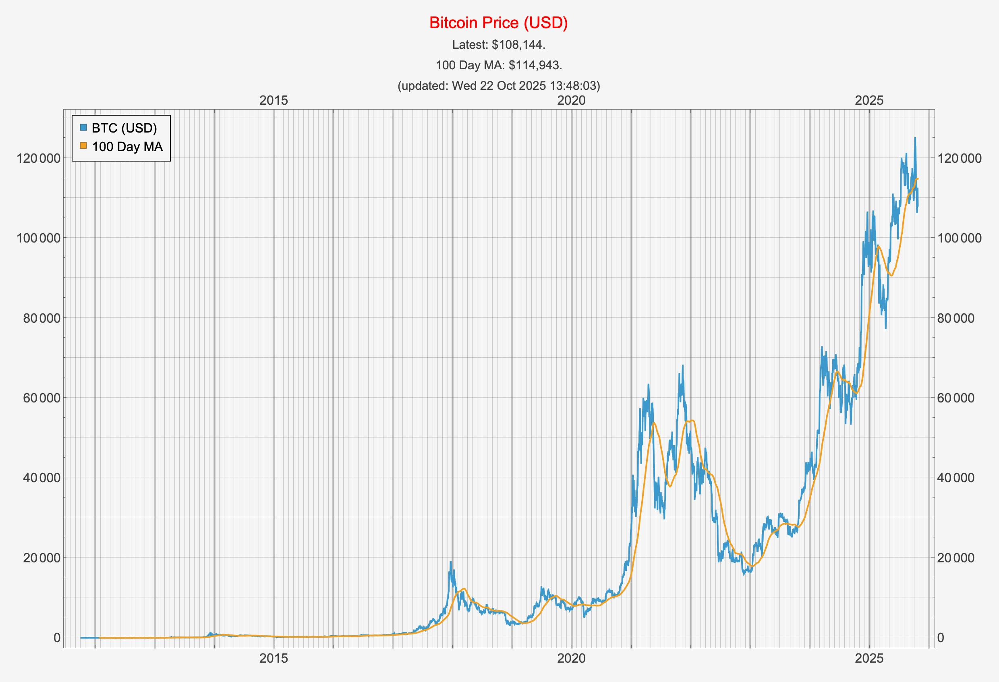
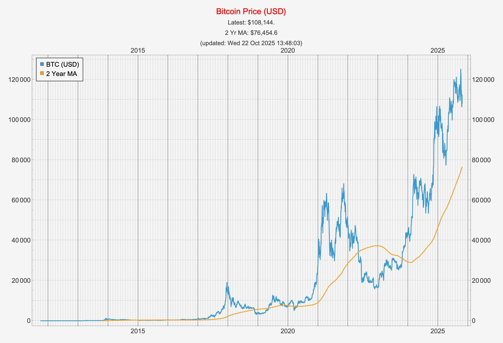
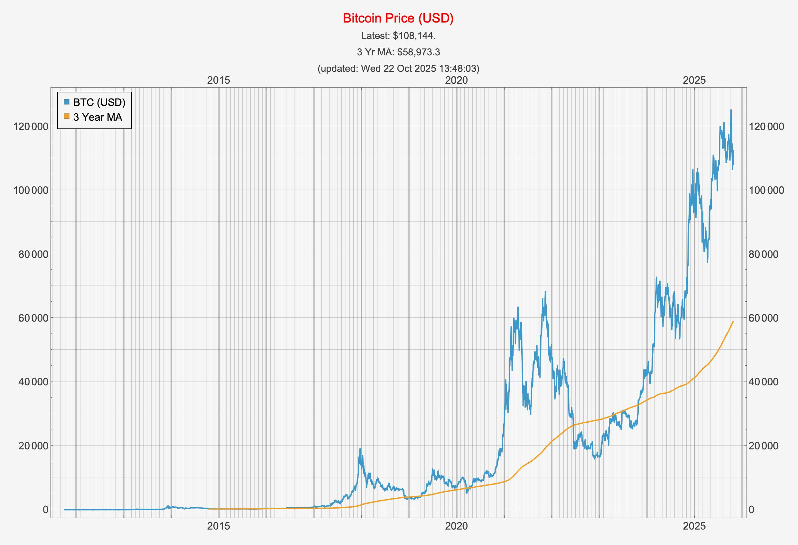
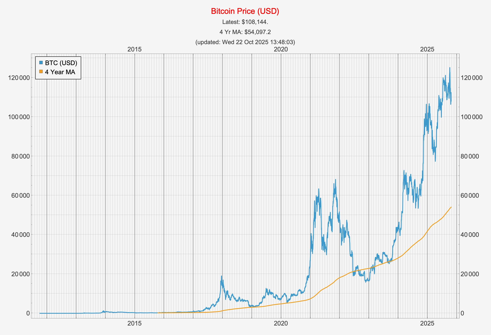

# BTC-USD Moving Averages

This notebook plots several moving averages of the BTC-USD price.

## 100 Day Moving Average

## 200 Day Moving Average

## 1 Year Moving Average

## 2 Year Moving Average

## 3 Year Moving Average

## 4 Year Moving Average

## 5 Year Moving Average

