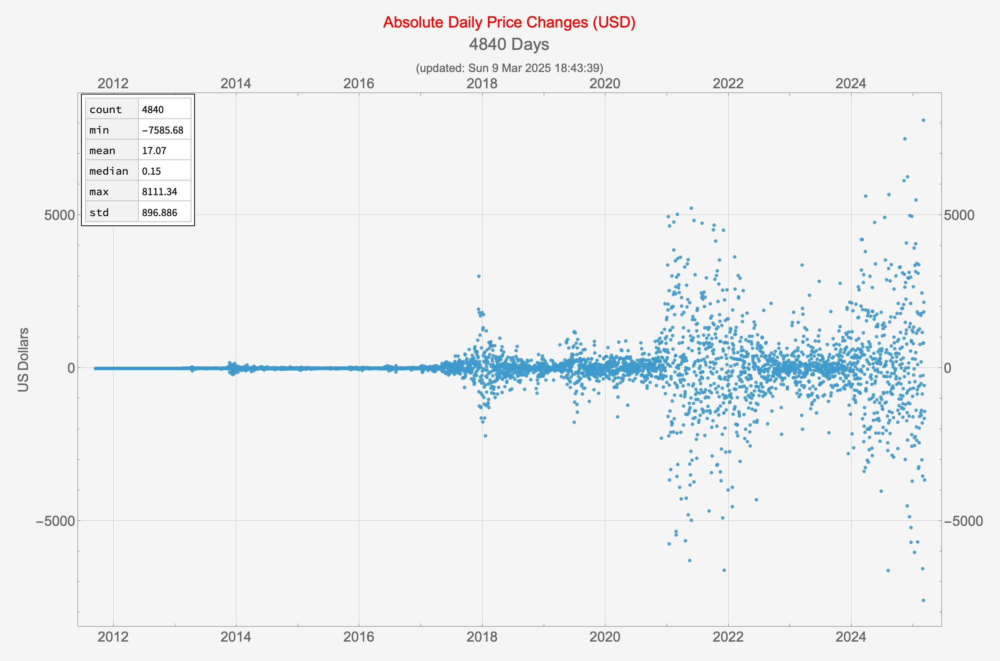
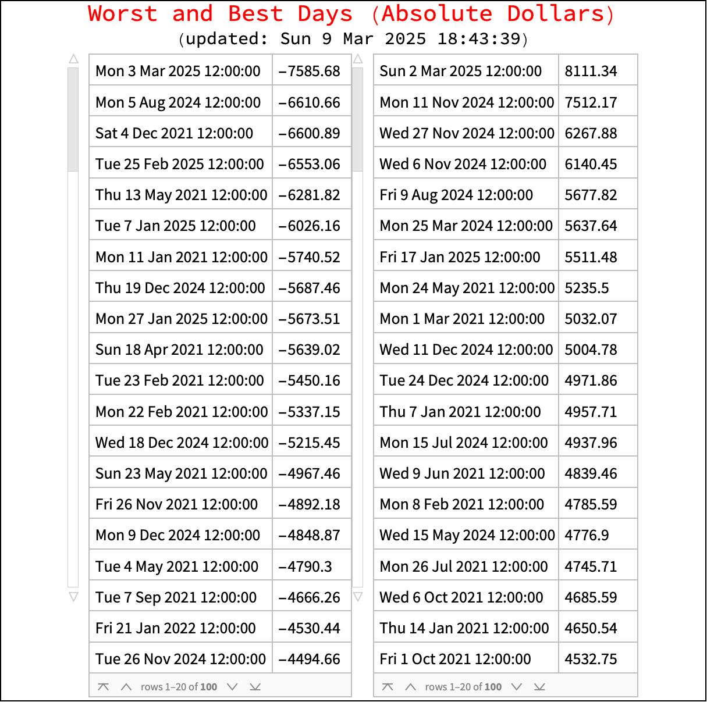
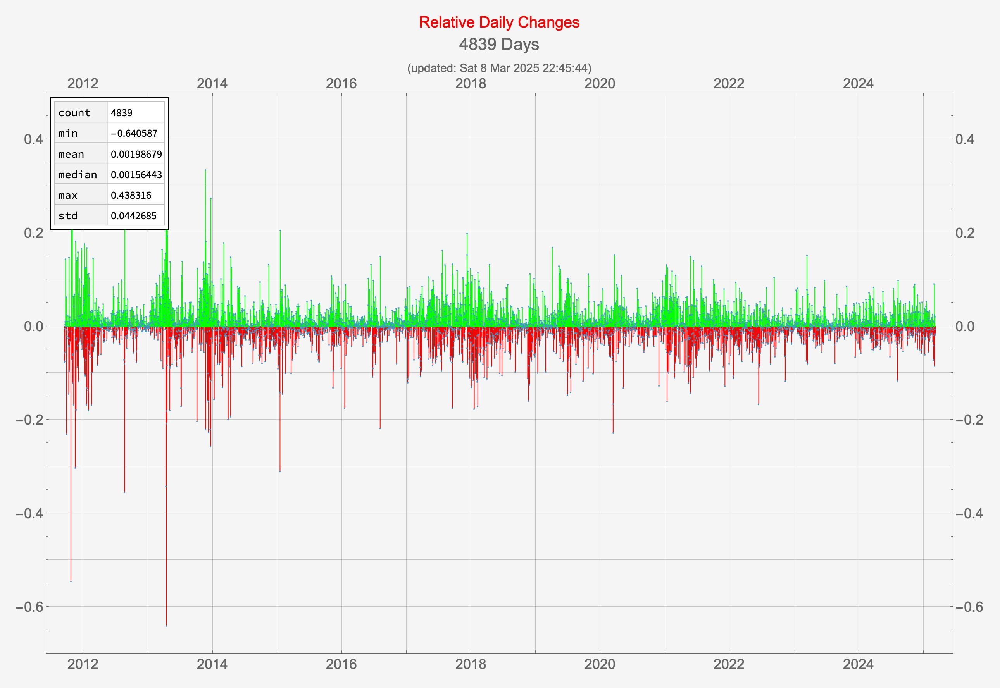
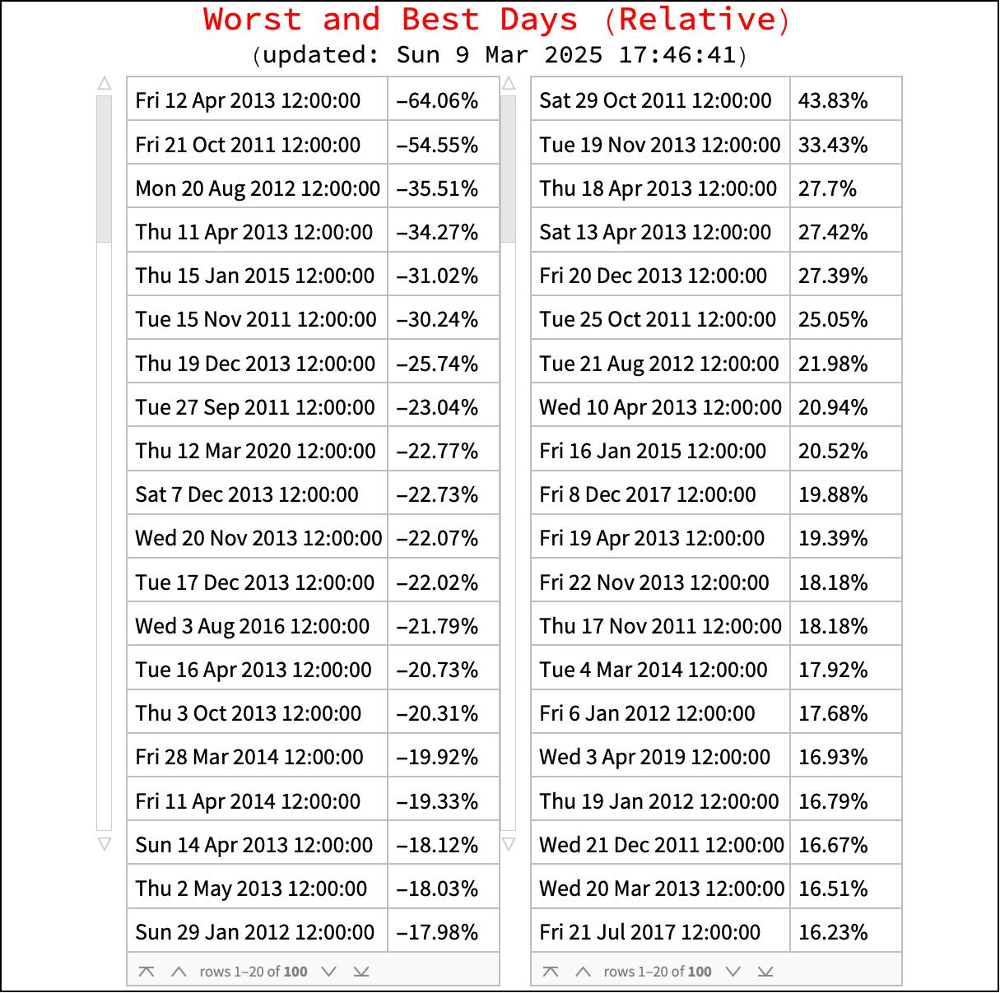
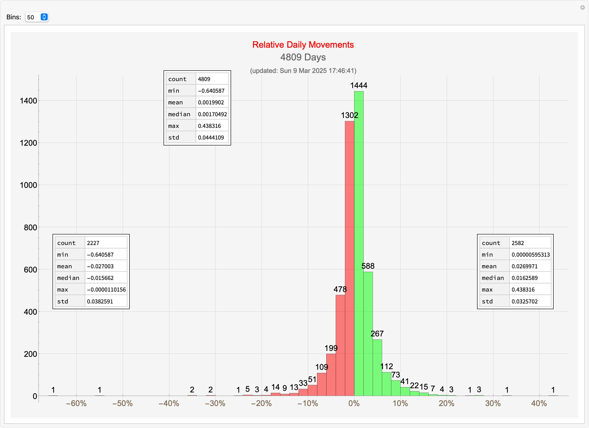
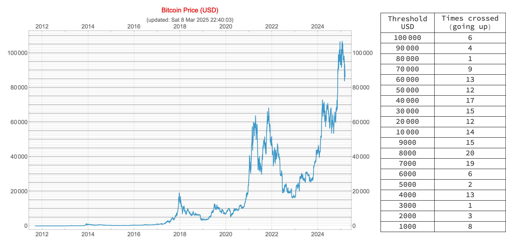

# btc

This repository contains Mathematica notebooks that examine Bitcoin/USD price movements, and other related BTC data.

There are two notebooks currently stored here:

* `BTC-USD-Movements.nb`
* `BTC-USD-threshhold-crossings.nb`

## File `BTC-USD-Movements.nb`

An examination of Bitcoin/USD absolute and relative price movements.

### Absolute price movements

### Relative price movements

## File `BTC-USD-threshhold-crossings.nb`

A more whimsical examination of Bitcoin/USD price movements in terms of threshholds crossed.

