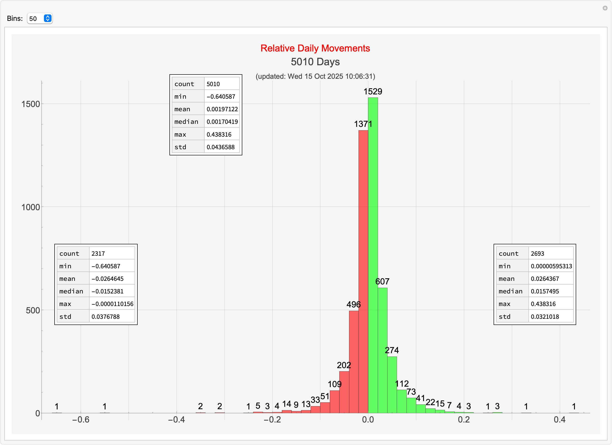

# btc

This repository contains Mathematica notebooks that examine Bitcoin price movements, and other BTC-related data.

There are three notebooks currently stored here, along with a few others that 
are still in development and not yet listed in this README.

* `BTC-USD-Movements.nb`
* `BTC-USD-threshhold-crossings.nb`
* `BTC-ROI.nb`
* `BTC-DCA.nb`

## `BTC-USD-Movements.nb`

An examination of Bitcoin/USD absolute and relative price movements.

### Absolute price movements

See more

### Relative price movements

Looking at the relative daily movements of Bitcoin/USD.

See more

## `BTC-USD-threshhold-crossings.nb`

Examination of Bitcoin/USD price movements in terms of the number of times a given price threshhold is crossed.

## `BTC-ROI.nb`

Looking at the return on investment for Bitcoin, given a start date, to today.

See more

## `BTC-DCA.nb`

Examination of the performance of daily dollar cost averaging from any given start
date to today.

