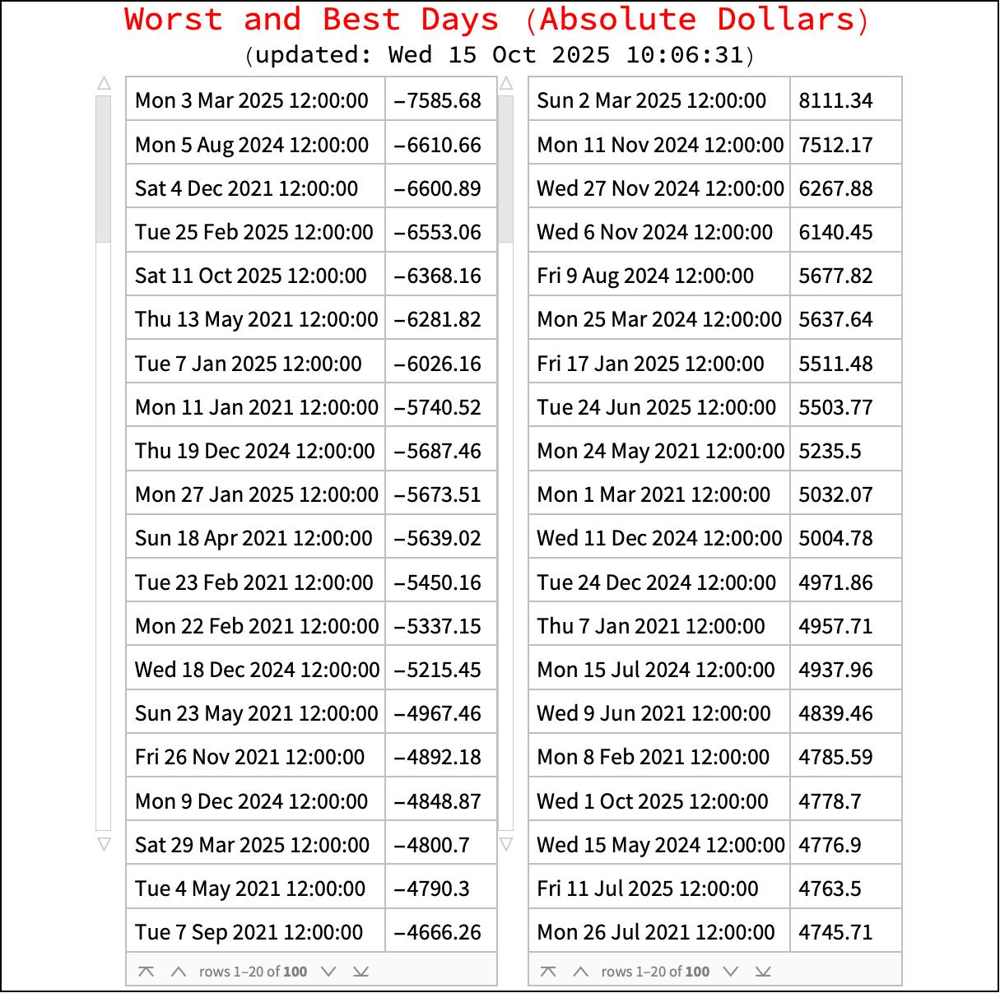

# btc

This repository contains Mathematica notebooks that examine Bitcoin price movements, and other BTC-related data.

There are two notebooks currently stored here:

* `BTC-USD-Movements.nb`
* `BTC-USD-threshhold-crossings.nb`

## `BTC-USD-Movements.nb`

An examination of Bitcoin/USD absolute and relative price movements.

### Absolute price movements

### Relative price movements

## `BTC-USD-threshhold-crossings.nb`

Examination of Bitcoin/USD price movements in terms of the number of times a given price threshhold is crossed.

