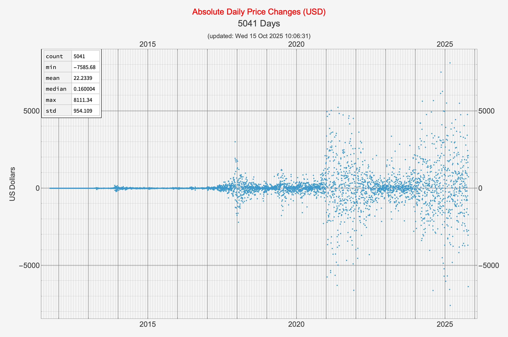
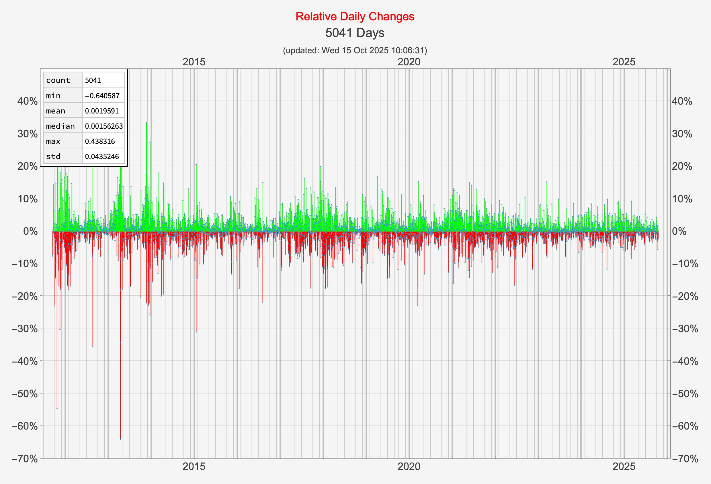
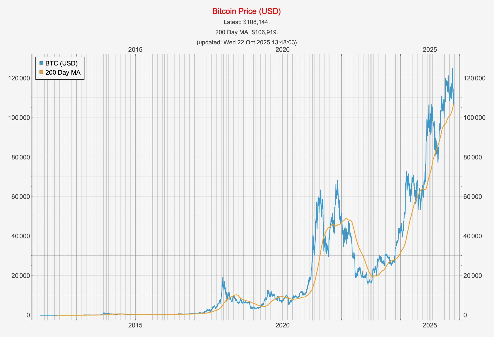
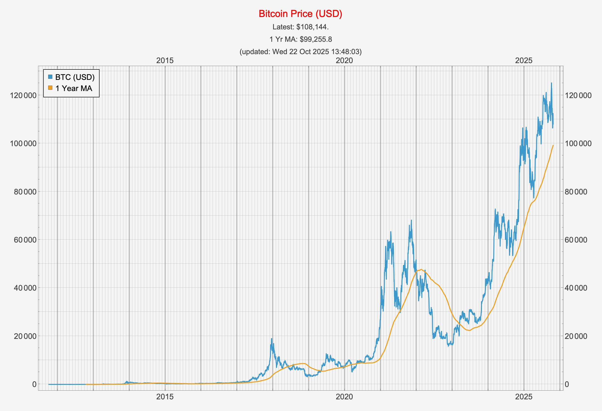
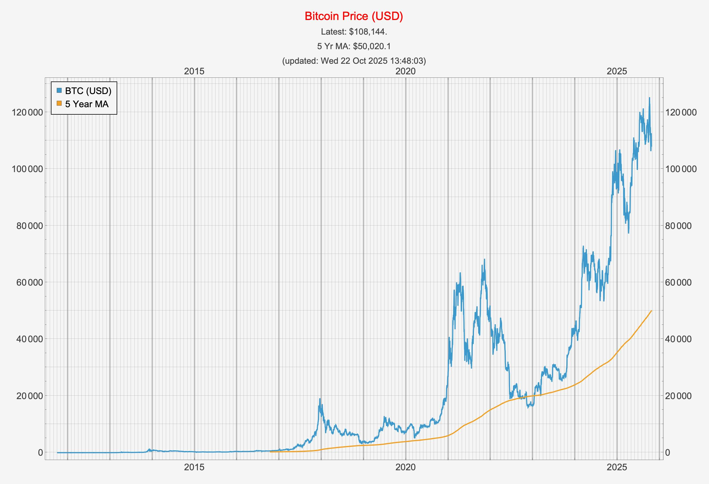
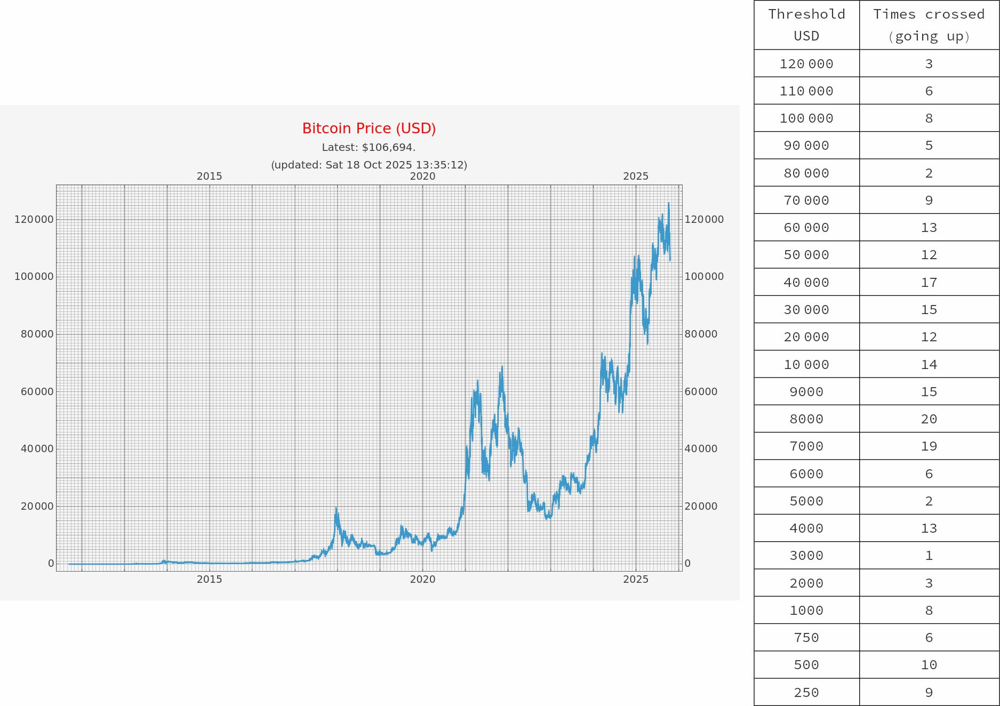
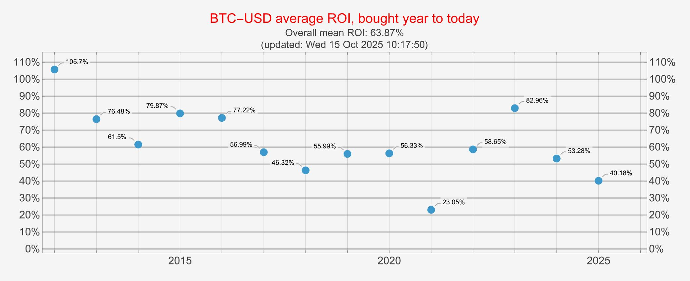
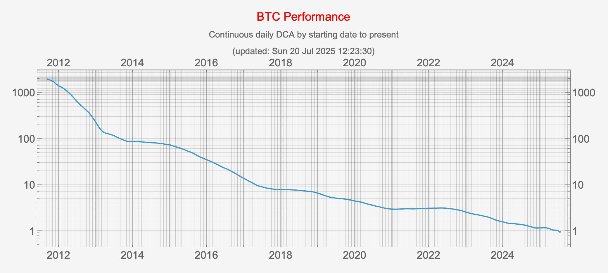

# btc

This repository contains Mathematica notebooks that examine Bitcoin price movements, and other BTC-related data.

There are three notebooks currently stored here, along with a few others that
are still in development and not yet listed in this README.

* `BTC-USD-Movements.nb`
* `BTC-USD-Moving-Averages.nb`
* `BTC-USD-threshhold-crossings.nb`
* `BTC-USD-Drawdowns.nb`
* `BTC-ROI.nb`
* `BTC-DCA.nb`
* `BTC-ETH.nb`

## `BTC-USD-Movements.nb`

An examination of Bitcoin/USD absolute and relative price movements.

### Absolute price movements

See more

### Relative price movements

Looking at the relative daily movements of Bitcoin/USD.

See more

## `BTC-USD-Moving-Averages.nb`

This notebook plots several moving averages of the BTC-USD price.

### 100 Day Moving Average

See more

### 200 Day Moving Average

### 1 Year Moving Average

### 2 Year Moving Average

### 3 Year Moving Average

### 4 Year Moving Average

### 5 Year Moving Average

## `BTC-USD-threshhold-crossings.nb`

Examination of Bitcoin/USD price movements in terms of the number of times a given price threshhold is crossed.

## BTC USD Drawdowns

An examination of the largest drawdowns in Bitcoin history.

## `BTC-ROI.nb`

Return on investment for Bitcoin, given a purchase date, presumed
held until today.

See more

## `BTC-DCA.nb`

Examination of the performance of daily dollar cost averaging from any
given start date to today.

## `BTC-ETH.nb`

ETH price to BTC price history.

